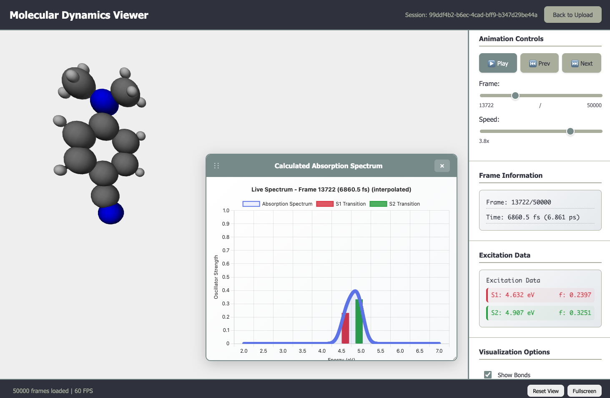

# DMABN Molecular Dynamics Viewer

A web application for visualizing and analyzing molecular dynamics simulations with real-time 3D rendering and interactive data visualization.



[](https://md-viewer-production.up.railway.app)
[](https://www.python.org/)
[](https://flask.palletsprojects.com/)

## Features

- Real-time 3D molecular structure visualization
- Interactive absorption spectrum and energy evolution charts
- Frame-by-frame animation controls
- Support for XYZ trajectory and excitation data files

## Tech Stack

**Backend:** Flask, NumPy, Pandas, Matplotlib, SciPy  
**Frontend:** Three.js, Chart.js, CSS, JavaScript  
**Deployment:** Docker, Railway

## Quick Start

```bash
git clone https://github.com/jramz87/MD-Viewer.git
cd MD-Viewer
pip install -r requirements.txt
python app.py
```

Navigate to `http://localhost:8080`

## Usage

Upload molecular dynamics files:
- `coors.xyz` - Trajectory coordinates
- `s1.dat`, `s2.dat` - Excitation data
- `fail.dat` - Failed calculations (optional but recommended)

Pending external contributor approval for release of data extraction codes

**Sample data will be uploaded soon for testing**

## Controls

- **Mouse:** Rotate and zoom molecular structure
- **Spacebar:** Play/pause animation
- **Arrow keys:** Navigate frames
- **R:** Reset view
- **F:** Fullscreen

## Roadmap

- Statistical mechanics analysis (RDF, thermodynamic properties)
- Transient absorption simulation
- Machine learning integration for trajectory analysis
- Enhanced visualization tools

## Contributing

Contributions welcome for scientific computing algorithms, web development improvements, and data analysis features.

## License

MIT License - see LICENSE file for details.
